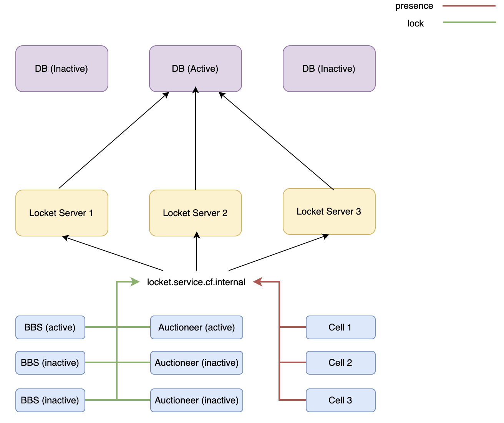
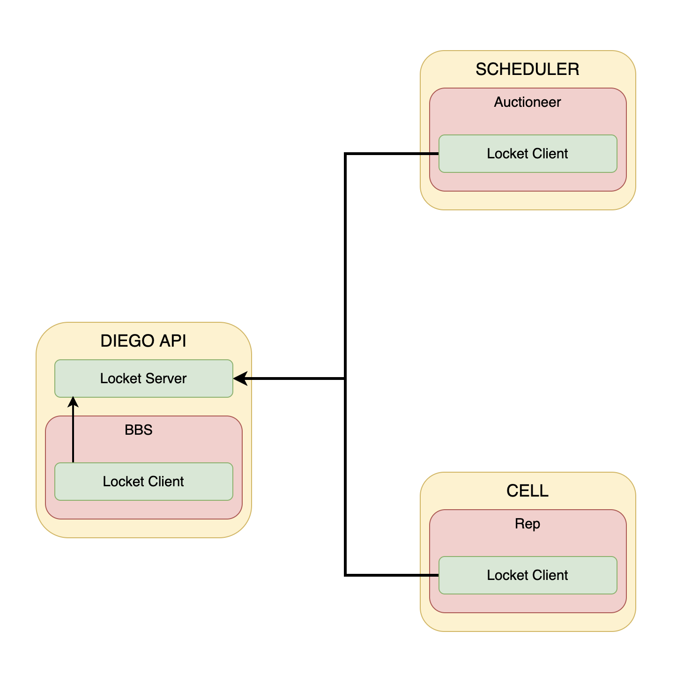
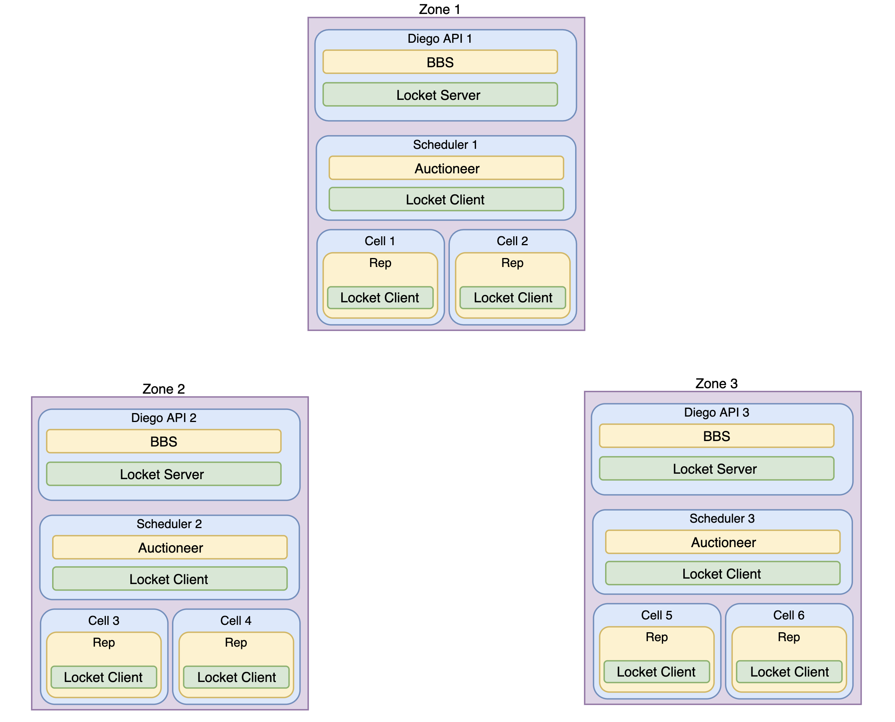
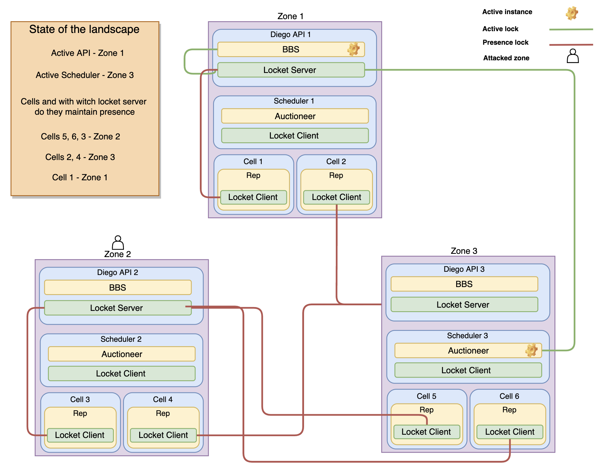
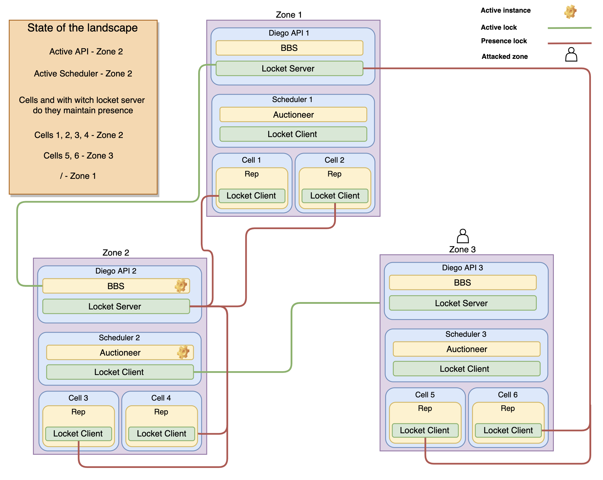
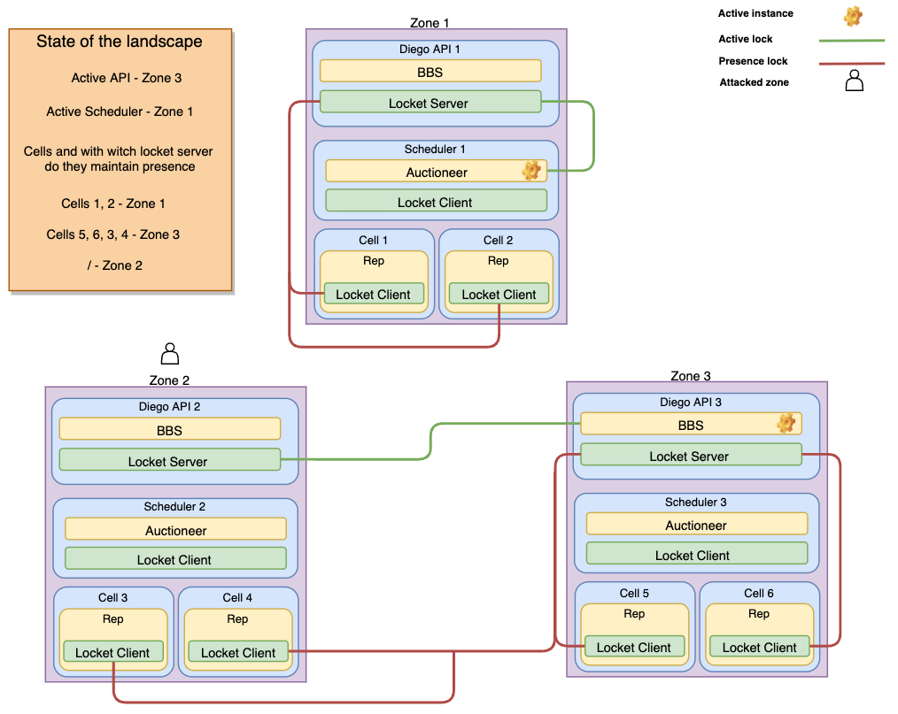
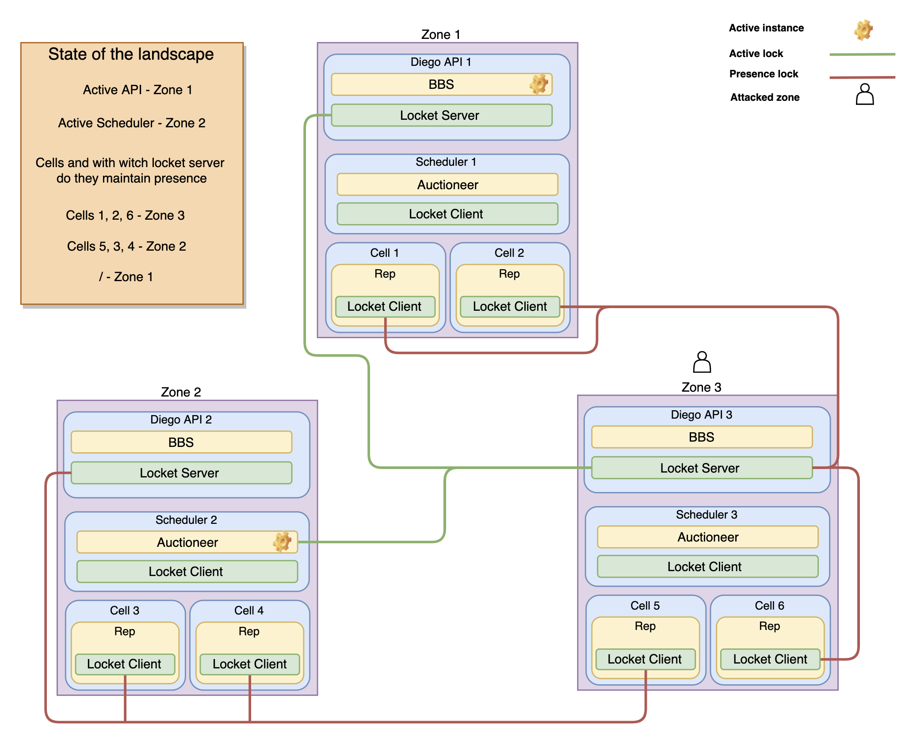

# Landscape performance during turbulence 

#### What is this ?
This is a research on how components like Diego-Api, Diego-Cells and Scheduler are using Bosh-DNS and a summary of test results, conducted with the [Turbulence-Release](https://github.tools.sap/cloudfoundry/turbulence-release) to simulate network delay. **These results should be seen as a refference, because on different vm_types, the numbers may change.**


### Prerequisites 
Make sure to go over [Bosh-DNS](https://bosh.io/docs/dns/) docs, [Client Side DNS Failover](https://misfra.me/2017/03/04/client-side-dns-failover/) doc and [Locket](https://github.com/cloudfoundry/locket/tree/master/doc) docs for better understanding the following content. As to the turbulence-release, simply put, this is a release which deploys a Turbulence API, which is a central point that receives "incidents", which are basically tasks and executes them with the help of turbulence agents. These agents live on every VM in every deployment ( at least for this setup. If you want you can select which deployments will have this agents ). The API also has a UI that allows you to track incidents.    

## Locket setup 
Locket is a distributed locking service that is used to keep track of the current state of various other services. The Locket Servers live on the Diego-Api's and they have a Locket Client, which is used by other services for communication. If we have a landscape with 3 az's and 3 Diego-api's, we will have 3 working Locket Servers. 




#### Locket Client
The Locket Client is used by components to communicate with the Locket Servers. 
```
locketTLSConfig, err := tlsconfig.Build(
		tlsconfig.WithInternalServiceDefaults(),
		tlsconfig.WithIdentityFromFile(config.LocketClientCertFile, config.LocketClientKeyFile),
	).Client(tlsconfig.WithAuthorityFromFile(config.LocketCACertFile))
	if err != nil {
		logger.Error("failed-to-open-tls-config", err, lager.Data{"keypath": config.LocketClientKeyFile, "certpath": config.LocketClientCertFile, "capath": config.LocketCACertFile})
		return nil, err
	}
	locketTLSConfig.InsecureSkipVerify = skipCertVerify

	conn, err := grpc.Dial(
		config.LocketAddress,
		grpc.WithTransportCredentials(credentials.NewTLS(locketTLSConfig)),
		grpc.WithDialer(func(addr string, _ time.Duration) (net.Conn, error) {
			return net.DialTimeout("tcp", addr, 10*time.Second) // give at least 2 seconds per ip address (assuming there are at most 5)
		}),
		grpc.WithBlock(),
		grpc.WithTimeout(10*time.Second), // ensure that grpc won't keep retrying forever
		grpc.WithKeepaliveParams(keepalive.ClientParameters{
			Time: 10 * time.Second,
		}),
	)
	if err != nil {
		return nil, err
	}
	return models.NewLocketClient(conn), nil
```
As you can see, the Client uses gRPC to talk to the server. When it starts, the Client selects a Locket Server using Bosh-DNS and opens a connection to it. Request's between the Client and the Server have 10s timeout and keep alive params. 

### Bosh DNS config
* auctioneer.service.cf.internal - q-s4.scheduler.cf.cf.bosh   
* bbs.service.cf.internal - q-s4.diego-api.cf.cf.bosh   
* locket.service.cf.internal - *.diego-api.cf.cf.bosh   

The s4 query returns all of the instances, including the unhealthy and unchecked ones. The timeout of a request to a certain server is 10s  **Notice that the locket service does not have the same query, it returns only the healthy instances of the service**



#### BBS 
The BBS works in a active passive architecture, meaning that there is one active instance and one or two passive instances (depends on if there are 2 or 3 az's ) that are ready to go and take over if there is a failure in the active one and it can no longer function. The active one maintains a lock of type - lock inside the locketDB that has a TTL (Time to live) of 15s. Every 5s, the Diego-Api's VM attempts to acquire the lock and if for some reason the active one isn't healthy, it releses the lock so another instance will acquire it and become the active one. BBS uses a Locket Client to communicate to the Locket Servers.

#### Diego-Cells
The diego cells also use the Locket service to maintain a lock of type - presence. The TTL and lock_retry_interval are the same - 15s and 5s. All healthy cells need to maintain their presence in LocketDB. If for some reason a cell loses its lock, BBS will consider it unhealthy. The Rep also uses a Locket Client. On start up, the Rep Locket Client will use Bosh-DNS to resolve a Locket Server ( locket.service.cf.internal ) and will open a connection to that server. From there on it will try to maintain its presence. 

#### Auctioneer 
The Auctioneer also works in a active passive architecture. It has a Locket Client and opens a connection to a Locket Server. From there, the active one needs to maintain his lock alive, while the passive ones try to take it every 5s. 

## Tests with turbulence


This is the landscape config during the test. We have 3 az's with 6 cells ( 2 in every zone ) 
After many runs and different scenarios, we have knowledge where we might have some problems and can do some improvements. 

### Scenario 1 
In the first scenario, we will take a look on how the cells handle load in a zone that does not have an active BBS instance. 




The interesting thing here is that when we attack Zone 2, the cells that use the Locket Server in that zone ( cells 5, 6, 3 ), they lose their presence lock, even if they are not in the attacked zone, and don't recover it if the delay is bigger than 3s. This happens because we have a TTL of 15s and we try to reach the server every 5s. At 3 sec delay, sometimes the cells are able to acquire a new presence lock. At 5s and higher, they are just gone. Strangely if the delay is even higher than 10s, they will not close the connection to that Locket Server. Since the timeout for the Locket Client is set to 10s, if the request takes longer they should pick another Locket Server, but they don't. So those cells are fully functional and healthy, but since they lost their presence, BBS does not consider them alive.

What went wrong here: 
* Cells should not be affected by a network delay in a diego-api instance, no matter if it is active or passive one. 

### Scenario 2 
Here we will take a look at the behaviour of the auctioneer when there is network load. 



In this scenario, the active auctioneer is in zone 2 but it uses the Locket Server in zone 3, so when we attack it, the active auctioneer loses the lock and there is a failover to another instance. So again, an attack on a completely different zone, on a different VM, affects the active auctioneer.

What went wrong here: 
* The Auctioneer had to switch to another instance, even if it is not affected by the attack at all. 

### Scenario 3
Here we have the same situation as in the previous scenario, just with the BBS. This case was the hardest to Reproduce during the test period, so it is the least likely to happen, but still is possible. 




We observe the same behaviour, since the active BBS in zone 3 has a Locket Client connected to the Locket Server in zone 2, when we attack that zone, the Diego-Api instance loses its lock, because it cannot acquire it in time. So in this case we have a failover as well. The good thing is that in most of the test I ran, unlike the cells, the BBS Locket Client does close the existing connection and opens a new one to another Locket Server. Now look at the locket service entry for Bosh DNS again. Since here only the healthy instances are returned, the DNS resolution does not have to wait for an attacked instance to respond.  

What went wrong here: 
* The BBS had to switch to another instance, even if it is not affected by the attack at all. 

What we see from scenario 2 and 3 is that when turbulence is present on the landscape, if big enough, there is a quite high chance of unnecessary failovers. Up until now, all the scenarios were isolated to 1 problem. Things get worse when we combine them all. 


### Scenario 4 



When zone 3 is attacked, both the auctioneer and BBS's active instances lose their lock and failover to other instances. At the same time, cells 1, 2, 6 lose their presence and are gone. The cells do not failover to another Locket Server if the delay is larger than 3s. 

What went wrong here: 
* The BBS had to switch to another instance, even if it is not affected by the attack at all. 
* The Auctioneer had to switch to another instance, even if it is not affected by the attack at all. 
* Cells were affected by a network delay in a inactive Diego-Api. 

**To recap everything up until now, with the current configuration of the services, when turbulence is present, services are dependent on things they should not be**. 

## What about cf push ? 

If we look at Scenario 1, we have a cell that maintains its presence in z2, and that cell is selected for staging the app, if that cell loses its presence during the staging phase, the push will fail with - StagingError - Staging error: staging failed. During testing, I was not able to Reproduce a case that for example, the app has been staged and now BBS decides where to deploy it, it selects a cell and before the app is able to start, the cell loses its presence. In theory that also could be possible, but again, I was not able to Reproduce this. 

The other case is with Scenario 3. If we push a app, and there is a failover to another BBS instance, the push will fail with Stager is unavailable. 

## Conclusion 

From the results that were gathered during testing, we can see that there are a lot of things that could go wrong if turbulence is presentand and for sure there is room for improvements. In the case of the cells anything over 3s delay will result in lost presence locks and even with 15 or 20s the cells do not recover their presence for the duration of the turbulence. We need to understand better how the locket client works and how we can improve it so it can failover to another locket server when the presence can't be maintained with the current connection. 

As to the BBS and Auctioneer, if you attack the active instance zone, but it is they are connected to a server in another one, a failover will occur after 10s of delay. But if you attack only the locket server, 5s is enough to lose it's lock. Possible improvement could be changing the Bosh-DNS query. With the current one ( s4 ) all of the instances are returned, if there is turbulence in any zone, even if the zone does not contain the active instance, the DNS resolution is slower because it needs to wait for a responce from the attacked instance. That introduces general slownes in all the components that actively use BBS and Auctioneer. If we switch to s3, only the healthy instances will be used for the resolution and that slownes will be gone. But there are other things that need to be considered with the s3 query and we need to run the same tests to see if it makes things better.
* Cells - 3s+ - lost presence 
* BBS and Auctioneer - 5s+ on locket server - lost lock :: 10s+ on active instance - lost lock 
